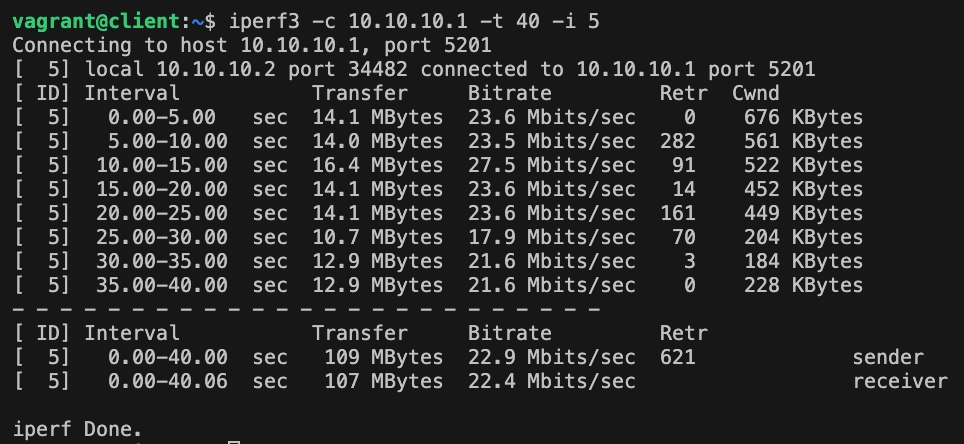

# Мосты, туннели и VPN

### Цель
Создание сетевой лаборатории для настройки VPN-сервер в Linux-based системах.  

### Описание задачи
  
- Настроить VPN между двумя ВМ в tun/tap режимах, замерить скорость в туннелях, сделать вывод об отличающихся показателях;
- Поднять RAS на базе OpenVPN с клиентскими сертификатами, подключиться с локальной машины на ВМ.
  
Вывод iperf3 в режиме туннеля tap  
 
  
Вывод iperf3 в режиме туннеля tun  
 
