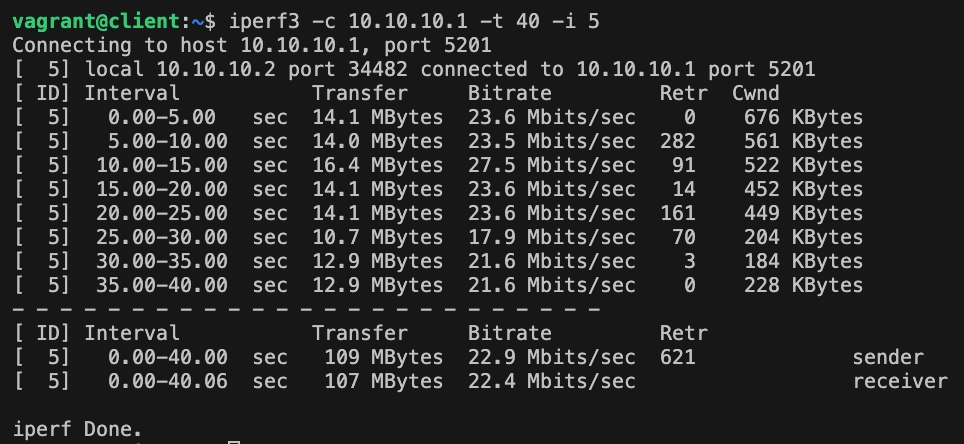
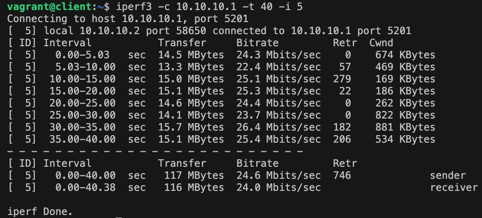

# Мосты, туннели и VPN

### Цель
Создание сетевой лаборатории для настройки VPN-сервер в Linux-based системах.  

### Описание задачи
  
- Настроить VPN между двумя ВМ в tun/tap режимах, замерить скорость в туннелях, сделать вывод об отличающихся показателях;
- Поднять RAS на базе OpenVPN с клиентскими сертификатами, подключиться с локальной машины на ВМ.

### TUN/TAP режимы VPN 
  
Для выполнения первого пункта подготовлен Vagrantfile, который поднимает тестовый стенд с 2 виртуальные машины server и client.  
Для запуска стенда необходимо выполнить команду: ``` vagrant up ```
  
Подготовлены файлы конфигурации для openvpn сервера и клиента.
  
Конфигурация сервера:
```
dev tap  
ifconfig 10.10.10.1 255.255.255.0   
topology subnet  
secret /etc/openvpn/static.key  
comp-lzo  
status /var/log/openvpn-status.log  
log /var/log/openvpn.log  
verb 3  
```
  
Конфигурация клиента: 
```
dev tap 
remote 192.168.56.10 
ifconfig 10.10.10.2 255.255.255.0 
topology subnet 
route 192.168.56.0 255.255.255.0 
secret /etc/openvpn/static.key
comp-lzo
status /var/log/openvpn-status.log 
log /var/log/openvpn.log 
verb 3 
```
  
Для смены типа туннеля необходимо изменить его в блоке dev файлов конфигурации: 
``` dev tap  ``` - для режима tap
``` dev tun  ``` - для режима tun
  
Так же подготовлены service unit для запуска OpenVPN
  
service unit для запуска OpenVPN для сервера:
```
[Unit] 
Description=OpenVPN Tunneling Application On %I 
After=network.target 
[Service] 
Type=notify 
PrivateTmp=true 
ExecStart=/usr/sbin/openvpn --cd /etc/openvpn/ --config %i.conf 
[Install] 
WantedBy=multi-user.target
```
  
service unit для запуска OpenVPN для клиента:
```
[Unit] 
Description=OpenVPN Tunneling Application On %I 
After=network.target 
[Service] 
Type=notify 
PrivateTmp=true 
ExecStart=/usr/sbin/openvpn --cd /etc/openvpn/ --config %i.conf 
[Install] 
WantedBy=multi-user.target
```
  
  Настройка стенда осуществляетс по средствам ansible-playbook, который запускается командой: ``` ansible-playbook ./ansible/playbook.yml -i ./ansible/hosts.ini ```


Вывод iperf3 в режиме туннеля tap  
 
  
Вывод iperf3 в режиме туннеля tun  
 
